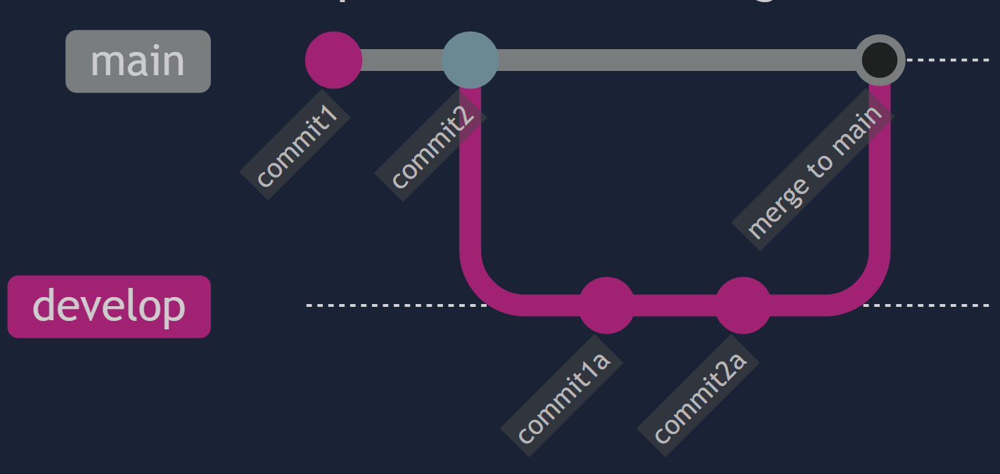

# Working With Branches

Branching is a concept in Git called that allows you to make your changes without having to worry about breaking what you have now.

Branches in Git allow your repository to hold multiple alternate reality versions of your files at the same time.

The default branch in Git is called `main`. This is the branch that is created when you initialize a new repository. You have been working on the `main` branch the whole time when you used the command `git config --global init.defaultBranch main` you were setting the name of what’s called the default branch for your repos.

Like the branches in a tree, all of the branches for a project stem off of the `main` branch or off of other branches.

When you make commits on a specific branch, those changes only exist on that branch, leaving all of your other branches exactly as they were when you branched off of them.

**This means that you can keep your main branch as a place for only finished features that you know are working properly**, and add each feature to your project using dedicated branches which we call **feature branches**.

## Using Branches

- make new branches by using the command `git branch <branch_name>`.
- To push the new branch you created to your remote repo use the command `git push origin <branch_name>`
- change to your new branch using `git checkout <branch_name>`.
- create a new branch and change to it in a single command by using the `-b` flag with `checkout` `git checkout -b <branch_name>`.
- You can see all of your current branches using `git branch` with no other arguments. The branch that you’re currently on will be indicated with an asterisk.
- When you push from the branch you’d use `git push origin <branch_name>` instead of `git push origin main`
- To change to main branch use `git checkout main`.
- When you don’t need a branch anymore, it can be deleted using `git branch -d <branch_name>` if the branch has already been merged into `main`. **Before you delete a branch, you have to switch to another branch first**.
- You can also use `git branch -D <branch_name>` to delete a branch that hasn’t been merged to `main` yet.

Once you are done working on your feature branch and are ready to bring the commits that you’ve made on it to your main branch, you will need to perform what is known as a `merge`.

Merges are done by using the command `git merge <branch_name>` which will take the changes you’ve committed in branch_name **and add them to the branch that you’re currently on not the main branch** so you have to be on the main branch before you merge.

When you finish working on a branch you will usually want to delete branches when you’re done with them, otherwise **they can pile up and make it more difficult to find the branch you’re looking for** when you need it.

You can see an example of a `develop` branch being created, committed to, and then merged to `main` in the diagram below.

{width=450px}

Sometimes, the same lines in a file will have been changed by two different branches. When this happens, you will have a **merge conflict** when you try and merge those branches together. In order to finish merging the branches you will have to first resolve the conflict.

## Sharing code

Branches can help you if you want to share your code with others. You can use branches to work on a feature and then share that branch with others to get feedback on your work.

You can also use it if you have a bug in your code that you need help fixing. You can create a branch with the bug and share it with others so they can help you fix it.

*For example:* if you have a bug in a new feature you’re working on that you can’t figure out, and it causes your code to break, you don’t want to commit that broken code and have it in your project’s “permanent record”. You could instead create a new temporary branch, switch to it and commit your code to this new branch. If you then push this new temporary branch to GitHub you can share it with others that may be able to help solve your problem.
