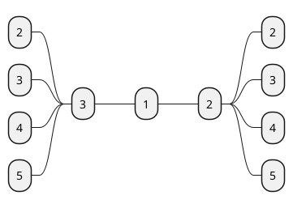

## Plant uml

$$\int_{-\infty}^{\infty}e^{-x^{2}}d x=\ \sqrt{\pi}$$

$$f(x)=a_{0}+\sum_{n=1}^{\infty}\left(a_{n}\cos\frac{n\pi x}{L}+b_{n}\sin\frac{n\pi x}{L}\right)$$

$$\begin{matrix}{c c c}{{}}&{{}}&{{a_{12}+b_{12}}}&{{\cdots}}&{{a_{1n}+b_{1n}}}\\ {{a_{21}+b_{21}}}&{{a_{22}+b_{22}}}&{{\cdots}}&{{a_{2n}+b_{2n}}}\\ {{}}&{{}}&{{\ddots}}&{{}}\\ {{a_{m1}+b_{m1}}}&{{a_{m2}+b_{m n}+a_{m n}}}\end{matrix}$$
