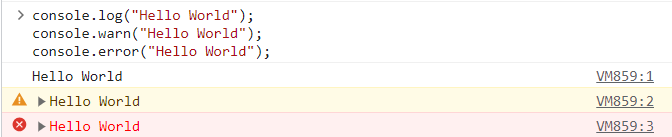
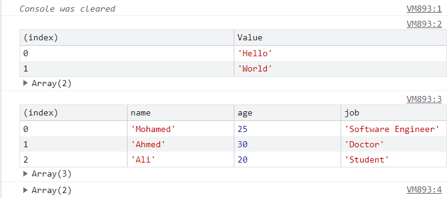
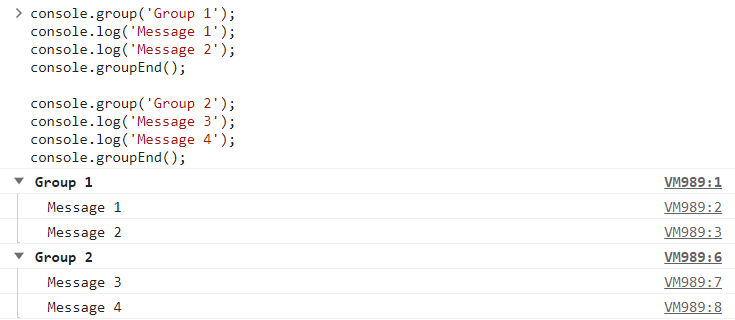
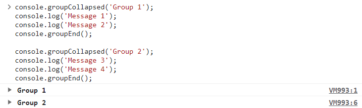
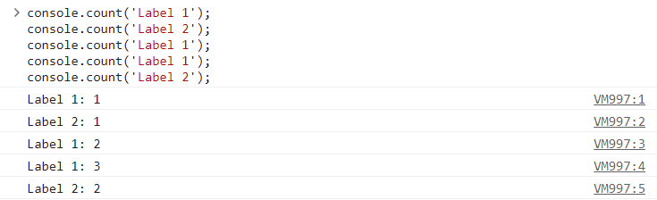
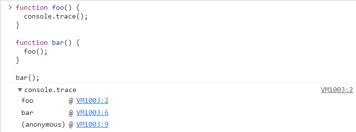
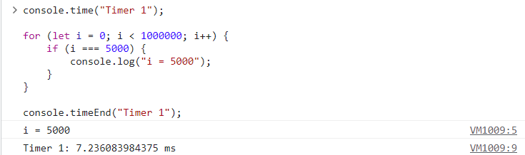

# [Console overview](https://developer.chrome.com/docs/devtools/console/)

The effect of the `console` methods may be different in different browsers. The following table shows the behavior in Chrome. The behavior also may not appear in windows terminal as expected so you better test these in browser dev tools not inside VSCode. Example console methods: `console.log()`, `console.warn()`, `console.error()`, ...etc.

The main difference between all these methods is how they display the data that you're logging. But you can also make things like changing page content from console. Example `document.querySelector('h1').textContent = 'Hello World'` will change the text of the first `h1` element in the page to `Hello World`. Console also allows you to try out new things and test your code.

There is even a function that lets you debug your code from the console. Example `debug(hello)` will pause the execution of the function `hello` and let you debug it.

| Methods of `console.`  | Description |
| ---- | ---------------- |
| `warn()` | Logs warning messages to the console. |
| `error()` | Logs error messages to the console. |
| `clear()` | Clears the console. You can also clear messages with the Clear button |
| `table()` | Displays data in a tabular format. |
| `dir()` | Displays an interactive list of the properties of the specified JavaScript object. |
| `group()` | Creates a new inline group, indenting all following output by another level. To move back out a level, call `groupEnd()`. |
| `groupCollapsed()` | Creates a new inline group, indenting all following output by another level. However, unlike `group()`, starts with the inline group collapsed requiring the use of a disclosure button to expand it. To move back out a level, call `groupEnd()`. |
| `count()` | Logs the number of times that this particular call to `count()` has been called. |
| `trace()` | Outputs a stack trace to the console. |
| `time()` | Starts a timer (can track how long an operation takes). |

## Example Usage

```{.js .numberLines}
console.log("Hello World");
console.warn("Hello World");
console.error("Hello World");
```



---

```{.js .numberLines}
console.clear(); // Just cleaars the console
console.table(["Hello", "World"]);
console.table([
 { name: "Mohamed", age: 25, job: "Software Engineer" },
 { name: "Ahmed", age: 30, job: "Doctor" },
 { name: "Ali", age: 20, job: "Student" },
]);
console.dir(["Hello", "World"]);
```



**Notice that the input lines doesn't appear in the image above because we used `console.clear()`.**

---

```{.js .numberLines}
console.group('Group 1');
console.log('Message 1');
console.log('Message 2');
console.groupEnd();

console.group('Group 2');
console.log('Message 3');
console.log('Message 4');
console.groupEnd();
```



---

```{.js .numberLines}
console.groupCollapsed('Group 1');
console.log('Message 1');
console.log('Message 2');
console.groupEnd();

console.groupCollapsed('Group 2');
console.log('Message 3');
console.log('Message 4');
console.groupEnd();
```



---

```{.js .numberLines}
console.count('Label 1');
console.count('Label 2');
console.count('Label 1');
console.count('Label 1');
console.count('Label 2');
```



---

```{.js .numberLines}
function foo() {
  console.trace();
}

function bar() {
  foo();
}

bar();
```



---

```{.js .numberLines}
console.time("Timer 1");

for (let i = 0; i < 1000000; i++) {
 if (i === 5000) {
  console.log("i = 5000");
 }
}

console.timeEnd("Timer 1");
```


