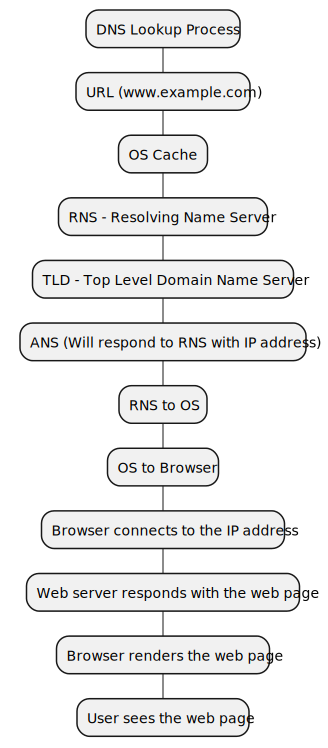

---

When you type `www.google.com` you actually type `www.google.com.` the dot at the end represents **root the internet namespace**, this dot is where it all begins.

When you first search for `www.example.com.`:

1. your browser and OS will check if they know the IP address of `www.example.com.` in their cache.
2. If not, the OS will ask the resolving name server if it knows the IP address of `www.example.com.`.
   - resolving name server is the work horse of the DNS lookup
   - it's either configured manually or automatically
3. If the **resolving name server** doesn't know the IP address of `www.example.com.` it will ask the **root name server** (Remember the dot at the end of `www.example.com.`?).
4. If the **root name server** doesn't know the IP address of `www.example.com.` it will ask the `com` name servers which are the **top level domain name servers (TLD)**.
5. If the **TLD name servers** doesn't know the IP address of `www.example.com.` it will ask the **`example.com` name servers** which are the **authoritative name servers**.
   - The **`com` TLD name servers** know which **authoritative name servers** to use by the help of domain registrars.
   - Domain registrars are the companies that sell domain names.
   - When a domain is purchased the registrar is told which **authoritative name servers** that domain will use.
   - Then they notify the organization responsible for **TLD name servers (The Registry)**.
   - The **Registry** will then update the **TLD name servers**.
6. The **authoritative name servers** will then respond with the IP address of `www.example.com.` to the **resolving name servers** which will store the IP address in its cache and give a response to the OS.
7. The OS will then store the IP address in its cache and give a response to the browser.
8. The browser will then store the IP address in its cache and make a request to the IP address.
9. The web server will then respond with the web page.
10. The browser will then render the web page.
11. Finally, the user will see the web page.

The whole cycle is very complex but it takes a few milliseconds.

{height=500px}

<!-- ```plantuml
@startmindmap
top to bottom direction
+ DNS Lookup Process
++ URL (www.example.com)
+++ OS Cache 
++++ RNS - Resolving Name Server
+++++ TLD - Top Level Domain Name Server
++++++ ANS (Will respond to RNS with IP address)
+++++++ RNS to OS
++++++++ OS to Browser
+++++++++ Browser connects to the IP address
++++++++++ Web server responds with the web page
+++++++++++ Browser renders the web page
++++++++++++ User sees the web page
@endmindmap
``` -->

The **resolving name server** doesn't go from from one server to another in the steps above unless it doesn't know the IP address of the domain name.

One lookup will require:

- Resolving name server
- Root name server
- TLD name server
- Authoritative name server

If any of these servers are slow it will affect the whole lookup and may lead to disaster.
