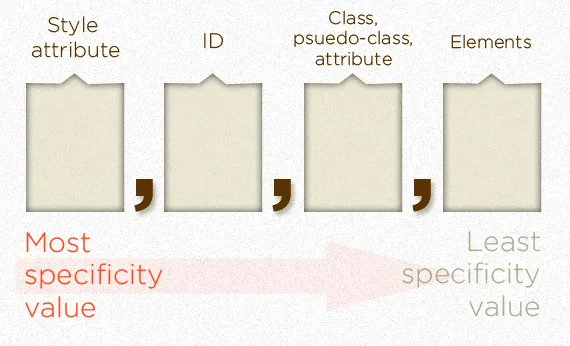

# CSS Selectors

1. `*`: This selector targets all elements on the page. It selects everything.

2. `Element`: Selects all instances of a specific HTML element, such as `p`, `div`, or `h2`.

3. `Element OtherElement`: This selects `OtherElement` that is a descendant of `Element`. For example, `div p` selects all `p` elements that are inside a `div`.

4. `.class-name`: Selects all elements with a specific class. For example, `.class-name` targets all elements with the class "class-name".

5. `#id-name`: Selects a specific element with the given ID. For instance, `#id-name` selects the element with the ID "id-name".

6. `.parent .child`: Selects all elements with class "child" that are descendants of an element with class "parent".

7. `.class-one.class-two`: Targets elements with both class "class-one" and class "class-two".

8. `.class-name div, .class-name p`: Selects `div` and `p` elements that have the class "class-name".

9. `Element.class-name`: Targets elements of a specific type with a particular class. For example, `p.class-name` selects all `p` elements with the class "class-name".

10. `.parent > .child`: Selects all elements with class "child" that are a direct child of an element with class "parent".

11. `Element + Other Element => [div + p]`: This selector targets a `p` element that is immediately preceded by a `div` element.

12. `Element ~ Other Elements => [p ~ div]`: This selector targets all `div` elements that are siblings of a `p` element, meaning they share the same parent and are preceded by the `p` element.

13. `[Attribute]`: Selects all elements that have the specified attribute, regardless of its value. For example, `[data-attribute]` selects all elements with a "data-attribute" attribute.

14. `Element[Attribute]`: Targets elements of a specific type that have the specified attribute. For instance, `a[href]` selects all `a` (anchor) elements with an "href" attribute.

15. `[Attribute=Value]`: Selects elements with a specific attribute value. For example, `[class="example"]` targets all elements with a class attribute equal to "example".

16. `Element[Attribute=Value] => input[type="submit"]`: Targets `input` elements with the attribute "type" set to "submit".

17. `[Attribute~=Value] => Contains A Word`: Selects elements where the attribute contains a specific word. For instance, `[class~=important]` targets elements with the class attribute containing the word "important."

18. `[Attribute*=Value] => Contains A String`: Selects elements where the attribute contains a specific substring. For example, `[href*="example"]` targets elements with an "href" attribute containing the substring "example."

19. `[Attribute^=Value] => Start With A String`: Selects elements where the attribute value starts with a specific string. For instance, `[class^="prefix"]` targets elements with a class attribute starting with "prefix."

20. `[Attribute$=Value] => End With A String`: Selects elements where the attribute value ends with a specific string. For example, `[class$="suffix"]` targets elements with a class attribute ending with "suffix."

21. `:first-child`: Selects an element that is the first child of its parent. For example, `p:first-child` selects the first `p` element among its siblings.

22. `:last-child`: Targets an element that is the last child of its parent. For instance, `li:last-child` selects the last `li` element among its siblings.

23. `:first-of-type`: Selects the first element of a specific type among its siblings. For example, `h2:first-of-type` selects the first `h2` element among its siblings.

24. `:last-of-type`: Targets the last element of a specific type among its siblings. For instance, `span:last-of-type` selects the last `span` element among its siblings.

25. `:only-child`: Selects an element that is the only child of its parent, meaning it has no siblings. For example, `div:only-child` selects a `div` element that is the only child of its parent.

26. `:not(Selectors)`: Selects elements that do not match the specified selectors. For example, `p:not(.special)` selects all `p` elements that do not have the class "special."

27. `:nth-child(n)`: Selects the nth child of its parent. The value of `n` can be a number, a keyword, or a formula. For instance, `li:nth-child(2)` selects the second `li` element among its siblings.

28. `:nth-last-child(n)`: Similar to `:nth-child(n)`, but counts the children from the end. For example, `div:nth-last-child(3)` selects the third-to-last `div` element among its siblings.

29. `:nth-of-type(n)`: Selects the nth child of its parent with a specific type. For example, `p:nth-of-type(odd)` selects all odd-numbered `p` elements among its siblings.

30. `:nth-last-of-type(n)`: Similar to `:nth-of-type(n)`, but counts the elements from the end. For instance, `span:nth-last-of-type(4)` selects the fourth-to-last `span` element among its siblings.

31. `:root`: is a special class that represents the very top level of your document - the one element that has no parents. Generally when working with the web, this is equivalent to the html element, but there are a [few subtle differences](https://stackoverflow.com/questions/15899615/whats-the-difference-between-css3s-root-pseudo-class-and-html).
    - `:root` is generally the place where you will place your ‘global’ CSS rules that you want available everywhere - such as your custom properties and CSS variables, or rules such as `box-sizing: border-box;`.

32. `:checked`: Selects input elements that are checked, such as checkboxes or radio buttons. It is often used in conjunction with these input types for styling or interaction.

33. `:empty`: Selects elements that have no children, including text nodes and empty spaces. For example, `p:empty` selects all empty `<p>` elements.

34. `:disabled`: Targets form elements that are disabled. This can include input fields, buttons, or other form elements with the `disabled` attribute.

35. `:required`: Selects form elements that are marked as required using the HTML `required` attribute. It's often used to style or apply specific behavior to required form fields.

36. `:focus`: Selects an element that is currently in focus. This is often used to style elements when they are selected by the user.

37. `:link` and `:visited` pseudo-classes are used to style links. `:link` targets links that have not yet been visited, while `:visited` targets links that have already been visited.

38. `:hover` will affect anything under the user’s mouse pointer.

39. `:active` applies to elements that are currently being clicked.

40. `::marker` allows you to customize the styling of your `<li>` elements’ bullets or numbers.

41. `::selection`: Targets the portion of a document that is currently selected by the user. It is often used to style the background or text color of the selected text.

42. `::placeholder`: Targets the placeholder text in an input field. It is often used to style the appearance of the placeholder text.

43. `::first-letter` and `::first-line` allow you to give special styling to the first letter or line of some text.

44. `::selection` allows you to change the highlighting when a user selects text on the page.

45. `::before` and `::after` allow us to add extra elements onto the page with CSS, instead of HTML. Using it to decorate text in various ways is one common use case

---

# From Articles

[Creating Complex Selectors With Nesting](https://developer.mozilla.org/en-US/docs/Learn/CSS/Building_blocks/Selectors/Combinators#creating_complex_selectors_with_nesting)

The difference between pseudo-classes and pseudo-elements is that Pseudo-class selectors are prefixed with a **single colon `:`** and are a different way to target **elements that already exist in HTML**. Pseudo-elements are prefixed with **two colons `::`** and are used to target **elements that don’t normally exist in the markup**.

Pseudo-classes share the same specificity as regular classes (0, 0, 1, 0). Read [this article](https://css-tricks.com/specifics-on-css-specificity/) in particular [this part](https://css-tricks.com/specifics-on-css-specificity/#aa-calculating-css-specificity-value).

{width=350px}

The `:not()` sort-of-pseudo-class adds no specificity by itself, only what’s inside the parenthesis is added to specificity value.

{width=350px}

**Important Notes:**

1. The universal selector `*` has no specificity value `(0,0,0,0)`

2. Pseudo-elements (e.g. `::first-line`) get `0,0,0,1` unlike their psuedo-class brethren which get `0,0,1,0`

3. The `!important` value appended a CSS property value is an automatic win. It overrides even inline styles from the markup. The only way an `!important` value can be overridden is with another `!important` rule declared later in the CSS and with equal or great specificity value otherwise. You could think of it as adding `1,0,0,0,0` to the specificity value.

**Example on `:nth-child()`**

```{.css .numberLines}
.myList:nth-child(5) {/* Selects the 5th element with class myList */}
.myList:nth-child(3n) { /* Selects every 3rd element with class myList */}
.myList:nth-child(3n + 3) { /* Selects every 3rd element with class myList, beginning with the 3rd */}
.myList:nth-child(even) {/* Selects every even element with class myList */}
```

**`::before` and `::after` syntax:**

```{.html .numberLines}
<style>
  .hello::before {
    content: 'HELLO BEFORE ';
  }

  .hello::after {
    content: ' HELLO AFTER ';
  }
</style>

<body>
  <div> Let's <span class="hello">"say hello"</span>to this span!</div>
</body>
```

Using these pseudo-elements this way would give us this result:

`Let’s HELLO BEFORE "say hello" HELLO AFTER to this span!`