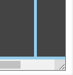

# Grid Layout

## Units & CSS Functions

Grid layout is used to create page layouts through a series of rows and columns. It is a newer layout system that is not supported by older browsers.

first you should use `display: grid;`{.css} to make the element a grid container. Then you can use `grid-template-columns` and `grid-template-rows` to define the columns and rows of the grid. You can also use `grid-template-areas` to define areas of the grid.

This is the syntax for defining the columns and rows:

```{.css .numberLines}
/* you can use px, em, rem, %, fr, auto */

/* This defines 3 columns with 100px width each */
grid-template-columns: 100px 100px 100px;

/* This defines 3 columns with 100px width each and 2 rows with 50px height each */
grid-template-columns: 100px 100px 100px;
grid-template-rows: 50px 50px;

/* This creates 3 columns with 30% 50% and 20% width each and 3 rows with auto height each */
grid-template-columns: 30% 50% 20%;
grid-template-rows: auto auto auto;

/* This creates 2 columns with percentages 2 and 1 */
grid-template-columns: 1fr 1fr; /* you can't do that with auto */

/* you can achieve the same result as before using % but sometimes it's hard to calculate the percentages like below so fr becomes handy and it's still not 100% accurate as fr */
grid-template-columns: 66.6666% 33.3333%;

/* you can also combine units */
grid-template-columns: 100px 1fr 2fr;

/* auto fits the content of the column or row unless the free space is not occupied by other columns or rows */
/* Here the first column with auto will fit the content of the text inside it and the second column will take the rest of the space */
grid-template-columns: auto 1fr;
/* Here the first column will take the whole space except for the space occupied by the second column content width only */
grid-template-columns: 1fr auto;
/* Here the first column will have 100px width and the second column will take the rest of the space */
/* both of the examples below do the exact same thing */
grid-template-columns: 100px auto;
grid-template-columns: 100px 1fr;

/* you can also use repeat to repeat a value */
/* This will create 3 columns with 100px width each */
grid-template-columns: repeat(3, 100px);


/* You can also specify the height of each row alone */
grid-template-rows: 100px 150px 50px;

/* you may also have many rows say 5 but you just specify the height of 3 of them and the rest will be the default which is auto so they will fit the height of the content */
grid-template-rows: 100px 150px 50px; /* we-have-five-columns */


/* you can also use minmax */
/* This will create 2 columns one with 200px width and the other will expand to fit the remaining space */
/* With our grid-template-columns set with minmax() values, each grid item’s width will grow and shrink with the grid container as it resizes horizontally. However, as the grid shrinks, the column tracks will stop shrinking at 100px, and as the grid grows, they will stop growing at 200px. */
grid-template-columns: minmax(100px, 200px) auto;


/* this will create 2 columns one with 100px width and the other will expand to fit the remaining space */
grid-template-columns: minmax(100px, 200px) 1fr;

/* if we have a grid container with 250px width this will overflow the grid container by 50px because the minimum width of the column is 200px and the other column has a width of 100px so the total width is 300px */
grid-template-columns: minmax(200px, 300px) 100px;

/* this will make a row with minimum height of 100px and maximum height of the content height so if the content need a height greater than 100px it will expand to fit the content height. */
grid-template-rows: minmax(100px, auto)

/* This will create as many columns with 100px width as it can fit in the available space */
grid-template-columns: minmax(100px, auto-fill)


/* This will create as many columns with 100px width as it can fit in the available space */
grid-template-columns: repeat(auto-fill, minmax(100px, 1fr));
/* does the same as above */
grid-template-columns: repeat(auto-fill, minmax(100px, auto)); 

/* the gap between the columns and rows can be specified using the gap property */
/* row-gap is the vertical gap between rows */
row-gap: 10px;
/* column-gap is the horizontal gap between columns */
column-gap: 10px;
/* with gap you can specify both row-gap and column-gap in one line */
/* 10px for row gap and 15px for column gap */
gap: 10px 15px;
/* with only one value the row gap and column gap will be the same */
gap: 10px;

/* ================================== */

/* The shorthand property for grid-template-columns and grid-template-rows is grid-template */
/* This will create three rows, each with a height of 100 pixels, and two columns, each with a width of 50 pixels. The values before and after the "/" represent the rows and columns, respectively. */
grid-template: 100px 100px 100px / 50px 50px;

```

***Some important information on `minmax()` function***: `minmax()` is a CSS function that is specifically used with Grid. It can only be used with the following CSS properties:

- `grid-template-columns`
- `grid-template-rows`
- `grid-auto-columns`
- `grid-auto-rows`

`auto` will automatically size the column or row to fit the content.

`fr` will divide the space into parts that have width or height depending on the fraction specified

`repeat(number_of_times, value)` will repeat the value the number of times specified

`minmax(minimum, maximum)` will specify the minimum and maximum width of the column or height of the row (they can be in the range between the minimum or maximum too not only take the minimum or maximum values). So in summary `minmax` will allow a column or row to expand to the maximum point if there is enough space and it will shrink to the minimum point if there is not enough space.

you can even combine functions for example `grid-template-columns: repeat(3, minmax(100px, 1fr));`{.css}

`auto-fill` will create as many columns or rows as it can fit in the container without overflowing it.

`gap: row-gap column-gap;` will specify the gap between the rows and columns respectively.

## Items Alignment

`justify-content` will align the items horizontally, the values for `justify-content` are:

1. `start` will align the items to the start of the row. `start` is the default value.
2. `end` will align the items to the end of the row
3. `center` will align the items to the center of the row
4. `space-around` will align the items with space around them
5. `space-between` will align the items with space between them
6. `space-evenly` will align the items with space evenly between them

```{.css .numberLines}
/* justify-content will align the items horizontally */
/* unlike flexbox justify-items will always work on the horizontal and not the main axis */
/* the default value is stretch */
justify-content: start;

/* the code above will not have an effect if the width of the columns is specified by fr units for example */
/* because the items will take the whole width of the column so you will not notice the effect of the justify-items property */
grid-template-columns: 1fr 1fr 1fr;
```

`align-content` will align the items vertically, the values for `align-content` are:

1. `stretch` will stretch the items to fill the whole height of the row. `stretch` is the default value.
2. `start` will align the items to the start of the row.
3. `end` will align the items to the end of the row
4. `center` will align the items to the center of the row
5. `space-around` will align the items with space around them
6. `space-between` will align the items with space between them
7. `space-evenly` will align the items with space evenly between them

> *// review this code*

```{.css .numberLines}
/* align-content will align the items vertically */
/* unlike flexbox align-items will always work on the vertical and not the cross axis */
/* the default value is stretch */
align-content: start;

/* the code above will not have an effect if the height of the rows is specified by fr units for example */
/* because the items will take the whole height of the row so you will not notice the effect of the align-items property */
grid-template-rows: 1fr 1fr 1fr;
```

## Merging Cells

In CSS Grid Layout you can merge cells using `grid-column-start`, `grid-column-end`, `grid-row-start`, `grid-row-end` properties.

We also have `grid-column` and `grid-row` properties that are shorthand for `grid-column-start`, `grid-column-end`, and `grid-row-start`, `grid-row-end` respectively.

```{.css .numberLines}
/* this will merge the first cell with the second cell */
grid-column-start: 1;
grid-column-end: 3;

/* if you don't know the number of columns you can use -1 to specify the last column */
grid-column-start: 1;
grid-column-end: -1;

/* you can also use the shorthand property */
/* this will merge the first cell with the second cell */
grid-column: 1 / 3;

/* you can even apply both properties to the same cell */
/* this will merge the first cell with the second cell on the first row */
grid-column: 1 / 3;
/* This will merge the first cell with the second cell on the first column */
grid-row: 1 / 2;

/* all the above applies to rows too */
```

You can also use Grid Areas to merge cells.

```{.css .numberLines}

/* A parent container with 3x3 cells 3 rows and 3 columns */
.parent {
  display: grid;
  grid-template-columns: 1fr 1fr 1fr;
  grid-template-rows: 1fr 1fr 1fr;
  grid-template-areas:
    "header header header"
    "nav main sidebar"
    "nav main sidebar"
    "footer footer footer";
}

.header {
  grid-area: header;
}

.nav {
  grid-area: nav;
}

.main {
  grid-area: main;
}

.sidebar {
  grid-area: sidebar;
}

.footer {
  grid-area: footer;
}


/* you can eve have an empty cell by specifying a dot */
.parent {
  display: grid;
  grid-template-columns: 1fr 1fr 1fr;
  grid-template-rows: 1fr 1fr 1fr;
  grid-template-areas:
    "header header ."
    "nav main sidebar"
    "nav . sidebar"
    "footer footer footer";
}
```

# Notes From Odin Lessons

only the direct child elements will become grid items here. If we had another element as a child under one of these child elements it would not be a grid item.

But just as you learned in the flexbox lessons, grid items can also be grid containers. So you could make grids inside of grids if you wanted.

If we have 4 items inside a 2x2 grid and we added a 5th item it will be placed in the 3rd row even if the layout we specified have only 2 rows. This is because of the implicit grid concept and it’s how CSS Grid is able to automatically place grid items when we haven’t explicitly defined the layout for them.

When we use the `grid-template-columns` and `grid-template-rows` properties, we are explicitly defining grid tracks to lay out our grid items. But when the grid needs more tracks for extra content, it will implicitly define new grid tracks. Additionally, the size values established from our `grid-template-columns` or `grid-template-rows` properties are not carried over into these implicit grid tracks. But we can define values for the implicit grid tracks.

We can set the implicit grid track sizes using the `grid-auto-rows` and `grid-auto-columns` properties. In this way we can ensure any new tracks the implicit grid makes for extra content are set at values that we defined. For ex:

```{.css .numberLines}
.container {
  display: grid;
  grid-template-columns: 50px 50px;
  grid-template-rows: 50px 50px;
  grid-auto-rows: 50px;
  /* by default the CSS Grid will add additional content with implicit rows and if we want columns instead we can use: */
  grid-auto-flow: column;
  /* To set the implicit track sizes for columns we can use: */
  grid-auto-columns: 50px;
}
```

**By default, CSS Grid will add additional content with implicit rows.** This means the extra elements would keep being added further down the grid in a vertical fashion. It would be much less common to want extra content added horizontally along the grid, but that can be set using the `grid-auto-flow: column` property and those implicit track sizes can be defined with the `grid-auto-columns` property.

***[Lesson Assignment](https://www.theodinproject.com/lessons/node-path-intermediate-html-and-css-creating-a-grid#assignment)***

---

The main difference between `display: inline-grid` and `display: grid` is how they behave in the document flow:

`display: grid` - Makes the element a block-level grid container, meaning it starts on a new line and takes up the full width available (stretches out to the edge of its parent container).

`display: inline-grid` - Makes the element an inline-level grid container, meaning it can flow inline with text and other inline elements. The width is only as large as necessary for its content (like any inline element).

Some key differences:

- `inline-grid` can sit next to text or other inline boxes on a line, `grid` cannot. It always starts a new line.
- `inline-grid` cannot have a width and height set, as it sizes to its content like inline elements. `grid` can have an explicit width/height set.
- Margins, padding, etc. behave differently on `inline-grid` vs `grid` due to the former being inline-level.
- Line breaks and alignment work differently with `inline-grid` vs `grid`.

There is an even shorter shorthand for positioning grid items with start and end lines. You can combine `grid-row-start / grid-column-start / grid-row-end / grid-column-end` into one line using `grid-area`.

```{.css .numberLines}
.item {
  /* The code above will span from row line 1 to row line 2 and from column line 3 to column line 5 */
  grid-area: 1 / 3 / 2 / 5;
}
```

Instead of using the grid lines to position all the items in a grid, we can create a visual layout of the grid in words. To do this we give each item on the grid a name using grid-area.

---

- `resize: both`. This is a property that allows the user to resize the container by clicking and dragging from the bottom right corner. The value `both` allows the user to resize both the width and height of the container. The value `horizontal` allows the user to resize only the width of the container. The value `vertical` allows the user to resize only the height of the container.



- `overflow: auto` is used to enable scrolling if we resize the container to be smaller than our grid can accommodate.

Both of these properties work together to allow the user to resize the container and scroll through the grid if it is too large to fit in the container. See [this Code Pen](https://codepen.io/TheOdinProjectExamples/pen/wvrBBXK?editors=1100) for better understanding.

- `fr` is also known as fractional unit.

- You distribute fraction units disproportionately while still using the `repeat()` function for ex: `grid-template-columns: repeat(2, 2fr) repeat(3, 1fr);` this is equivalent to `grid-template-columns: 2fr 2fr 1fr 1fr 1fr;`

- The minimum size of a grid track is the smallest size its elements can be without overflowing. This breakpoint is the item’s `min-content` value.

- When we resize our grid super small, it is reassuring to know that the browser will stop the item from shrinking beyond the `min-content` value. However, we really don’t want to rely on that most of the time. It’s much better for you to explicitly decide as a developer how small and large your content should be, even in the most extreme situations.

- Not only `minmax()` can be used when setting the size of a grid track, you can also use `min()`, `max()`, and `clamp()` all while still using `repeat()`

- Unlike `minmax()`, the `clamp()` function can be used anywhere, not just within a grid container. As with `min()` and `max()`. It creates a flexibly sized track with constraints.

Since `clamp()`’s purpose is to create a flexibly sized track with constraints, we want to use a dynamic value for the “ideal size” argument, and typically a static size for the minimum and maximum size, although it is possible to use a dynamic value here too.

Here is a simple non-grid example. We will look back at our grid in a moment:

```{.css .numberLines}
.simple-example {
  width: clamp(500px, 80%, 1000px);
}
```

This element, which we can pretend is just a div, will render with a width equal to 80% of its parent’s **width**, unless that number is lower than 500px or higher than 1000px, in which case it will use those numbers as its width.

Okay, now back to our grid:

```{.css .numberLines}
.grid-container {
  grid-template-columns: repeat(5, clamp(150px, 20%, 200px));
}
```

- `auto-fit` and `auto-fill` values are These two values are actually a part of the `repeat()` function specification. They are used for some cases like this: Say you want to give your grid a number of columns that is flexible based on the size of the grid. For example, if our grid is only `200px` wide, we may only want one column. If it’s `400px` wide, we may want two, and so on. Solving this problem with media queries would be a lot of typing. Thankfully, `auto-fit` and `auto-fill` are here to save the day!

According to the [W3 specification on `auto-fill` and `auto-fit`](https://www.w3.org/TR/css-grid-1/#auto-repeat), both of these functions will return **“the largest possible positive integer”** without the grid items overflowing their container. Here is a simple example:

```{.css .numberLines}
.simple-example {
  display: grid;
  width: 1000px;
  grid-template-columns: repeat(auto-fit, 200px);
}
```

For this grid, we have a set width of `1000px` and we are telling it to fill in our columns with tracks of `200px` each. As long as there are at least five grid items, this will result in a 5-column layout no matter what. In this case, `auto-fill` would actually do the same thing. We will get into the difference soon.

The real magic of `auto-fit` and `auto-fill` comes when we incorporate `minmax()` into the equation. With `minmax()`, we can tell our grid that we want to have as many columns as possible, using the constraints of our `minmax()` function to determine each column’s size, without it overflowing our grid. Check out how cool our grid looks when we resize it now!

```{.css .numberLines}
.grid-container {
  grid-template-columns: repeat(auto-fit, minmax(150px, 1fr));
}
```

See [this Code Pen](https://codepen.io/TheOdinProjectExamples/pen/abLzzgR)

*So what’s going on here specifically with `repeat(auto-fit, minmax(150px, 1fr));`?*

Simple! Remember that `auto-fit` will return the highest positive integer without overflowing the grid. So first, the browser has to know how wide our grid is: in this case, it’s just the window’s width (minus margins) because we didn’t explicitly set it. For the sake of this example, let’s pretend like our window is currently `500px` wide. Second, the browser needs to know how many grid column tracks could possibly fit in that width. To do this, it uses the minimum value in our `minmax()` function, since that will yield the highest number of items, which is `150px`. If our window is `500px` wide, this means our grid will render 3 columns. But wait, there’s more! Once the browser has determined how many columns we can fit, it then resizes our columns up to the maximum value allowed by our `minmax()` function. In this case, our max size is `1fr`, so all three columns will be given an equal allotment of the space available. As we resize our window, these calculations happen in realtime and the result is what you see in the above code pen example!

*What about auto-fill?*

In most cases, `auto-fill` is going to work exactly the same way as `auto-fit`. The difference is only noticeable when there are fewer items than can fill up the entirety of the grid row once. When the grid is expanded to a size where another grid item could fit, but there aren’t any left, `auto-fit` will keep the grid items at their `max` size. Using `auto-fill`, the grid items will snap back down to their `min` size once the space becomes available to add another grid item, even if there isn’t one to be rendered. They will continue their pattern of growing to `max` and snapping back to their `min` as the grid expands and more room becomes available for new grid tracks.

To see this in action, look at the following 2 examples, the first with `auto-fit` and the second with `auto-fill` and see what happens when you resize the grid horizontally:

- [Example 1](https://codepen.io/TheOdinProjectExamples/pen/mdByJyJ)
- [Example 2](https://codepen.io/TheOdinProjectExamples/pen/KKXwpwX)

# Grid VS Flexbox

Grid and flexbox are both powerful layout tools in CSS that can help create responsive and attractive web designs. However, they have different strengths and weaknesses, and choosing the right one depends on the type of layout and the content.

One way to decide between grid and flexbox is to consider if the design starts from the content or from the layout. Content first design means that the content determines how the layout should be, while layout first design means that the layout is predefined and the content fills in the spaces.

Flexbox is more suitable for content first design, because it allows the items to flexibly grow, shrink, and align according to their size and position. Flexbox is ideal for one-dimensional layouts, where the items are arranged in either a row or a column. Flexbox can also wrap items to the next line or column, but this can be tricky and unpredictable.

Grid is more suitable for layout first design, because it allows the developer to define a precise grid of rows and columns and place the items in any cell. Grid is ideal for two-dimensional layouts, where the items are arranged in both rows and columns. Grid can also handle one-dimensional layouts, but it may be overkill for simple cases.

Flexbox and grid are not mutually exclusive, and they can be combined to create complex and responsive layouts. For example, the overall layout can be a grid, but each grid item can be a flex container that holds its own content. This way, the grid items can benefit from the two-dimensional placement of grid, while the content inside can benefit from the one-dimensional flexibility of flexbox.
