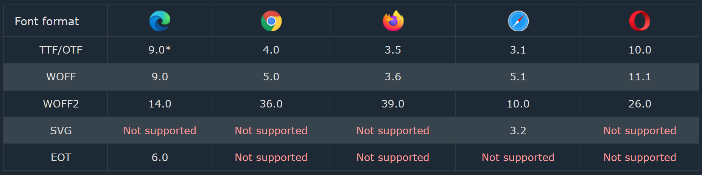

# Fonts and Text Styles

## `font-family`

The `font-family` property specifies the font for an element. The font family names can be separated by commas. When using `font-family` make sure to include callback fonts in case the first font wasn't installed.

You can get fonts from online font libraries such as:

1. [Google Fonts](https://fonts.google.com/)

2. [Font Library](https://fontlibrary.org/)

3. [Adobe Fonts](https://fonts.adobe.com/)

They will provide you with a link to include in your HTML file. For example:

```html
<link rel="stylesheet" href="https://fonts.googleapis.com/css?family=Roboto:400,700">
```

or an `@import` tag that can be dropped at the top of a CSS file.

```css
@import url('https://fonts.googleapis.com/css?family=Roboto:400,700');
```

Another way to include fonts is by downloading them and including them in your project using `@font-face`, for example:

```css
@font-face {
  font-family: 'my-font';
  src: url('fonts/Roboto-Regular.ttf');
}
```

And Here we need to talk about the different font formats.

### Font Formats

**TrueType Fonts (TTF)**

TrueType is a font standard developed in the late 1980s, by Apple and Microsoft. TrueType is the most common font format for both the Mac OS and Microsoft Windows operating systems.

**OpenType Fonts (OTF)**

OpenType is a format for scalable computer fonts. It was built on TrueType, and is a registered trademark of Microsoft. OpenType fonts are used commonly today on the major computer platforms.

**The Web Open Font Format (WOFF)**

WOFF is a font format for use in web pages. It was developed in 2009, and is now a W3C Recommendation. WOFF is essentially OpenType or TrueType with compression and additional metadata. The goal is to support font distribution from a server to a client over a network with bandwidth constraints.

**The Web Open Font Format (WOFF 2.0)**

TrueType/OpenType font that provides better compression than WOFF 1.0.

**SVG Fonts/Shapes**

SVG fonts allow SVG to be used as glyphs when displaying text. The SVG 1.1 specification define a font module that allows the creation of fonts within an SVG document. You can also apply CSS to SVG documents, and the `@font-face` rule can be applied to text in SVG documents.

**Embedded OpenType Fonts (EOT)**

EOT fonts are a compact form of OpenType fonts designed by Microsoft for use as embedded fonts on web pages.



## Text styles

### `font-style`

The `font-style` property specifies the font style for an element. The font style can be normal, italic.

The `<em>` element is for words that have a stressed emphasis compared to surrounding text, which is often limited to a word or words of a sentence and affects the meaning of the sentence itself.

Typically this element is displayed in italic type. However, it should not be used to apply italic styling; use the CSS font-style property for that purpose. Use the `<cite>` element to mark the title of a work (book, play, song, etc.). Use the `<i>` element to mark text that is in an alternate tone or mood, which covers many common situations for italics such as scientific names or words in other languages. Use the `<strong>` element to mark text that has greater importance than surrounding text. Read this important [MDN article](https://developer.mozilla.org/en-US/docs/Web/HTML/Element/em).

### `letter-spacing`

The `letter-spacing` property specifies the space between the characters in a text.

### `line-height`

The `line-height` property specifies the line height.

### `text-transform`

The `text-transform` property is used to specify uppercase and lowercase letters in a text. It can be `lowercase`, `uppercase`, `capitalize`, `none`.

### `text-shadow`

The `text-shadow` property adds shadow to text. The values of the property are `h-shadow`, `v-shadow`, `blur-radius`, `color`. Example:

```css
text-shadow: 2px 2px 4px rgba(30, 50, 120, 0.5);
```

### Elipsis

The `text-overflow` property specifies how **overflowed** content that is not displayed should be signaled to the user. It can be `clip` or `ellipsis`, `clip` is the default value which cuts off the text, `ellipsis` displays an ellipsis ("...") to represent clipped text. The `white-space` property specifies how white-space inside an element is handled.

```css
text-overflow: ellipsis;
white-space: nowrap;
```

Watch [this video](https://youtu.be/IWOLikk2yqs) to learn more about ellipsis.

You can see more detail and an example in [this CSS Tricks Article](https://css-tricks.com/snippets/css/truncate-string-with-ellipsis/). (Be ready to go look that article up every time you want to use this.)