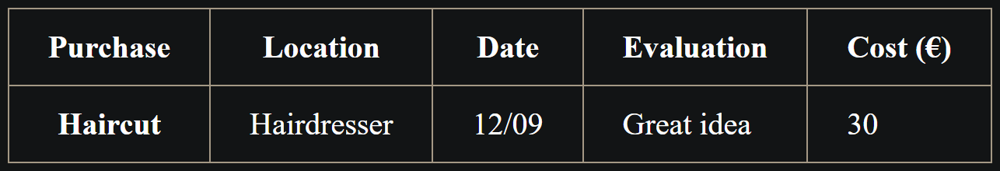

# Important Notes on HTML Tables

`colgroup` allows you to apply styles to a column.

```{.html .numberLines}
<table>
  <caption>
    Example Table
  </caption>
  <colgroup>
    <col style="background-color: green" />
    <col style="background-color: yellow" span="2" />
  </colgroup>
  <tr>
    <th>Data 1</th>
    <th>Data 2</th>
    <th>Data 3</th>
  </tr>
  <tr>
    <td>Calcutta</td>
    <td>Orange</td>
    <td>Apple</td>
  </tr>
  <tr>
    <td>Robots</td>
    <td>Jazz</td>
    <td>Rock</td>
  </tr>
</table>
```

The line `<col style="background-color: yellow" span="2" />`{.html} spans two columns and applies a yellow background to them, and of course you can still use `:nth-child` selector.

> *Note: Styling columns like this is limited to a few properties: border, background, width, and visibility. To set other properties you'll have to either style every `<td>` or `<th>` in the column, or use a complex selector such as :nth-child.*

You can also use caption to add captions to your table as in:

```{.html .numberLines}
<caption>
  Dinosaurs in the Jurassic period
</caption>
```

> *Note: The summary attribute can also be used on the `<table>` element to provide a description — this is also read out by screen readers. We'd recommend using the `<caption>` element instead, however, as summary is deprecated and can't be read by sighted users (it doesn't appear on the page).*

You can make your HTML table code semantic by using `<thead>`, `<tbody>` and `<tfoot>`. If you are using `<col>`, `<colgroup>` element, the table header should come just below those.

The browser adds `<tbody>` automatically if you don't add it. `<tbody>` also gives you more control over your table structure and styling.

# Tables & Accessibility

Tables are sometimes difficult for screen readers to read. So, we need to make sure that our tables are accessible.

By using column and row headers screen readers will identify all headers and use them to make programmatic associations between those headers and the cells they relate to. The combination of column and row headers will identify and interpret the data in each cell so that screen reader users can interpret the table similarly to how a sighted user does.

The `scope` attribute, which can be added to the `<th>` element to tell screen readers exactly what cells the header is a header for - is it a header for the row it is in, or the column.

*For example:*

```{.html .numberLines}
<thead>
  <tr>
    <th scope="col">Purchase</th>
    <th scope="col">Location</th>
    <th scope="col">Date</th>
    <th scope="col">Evaluation</th>
    <th scope="col">Cost (€)</th>
  </tr>
</thead>
```

And each row could have a header defined like this (if we added row headers as well as column headers):

```{.html .numberLines}
<tr>
  <th scope="row">Haircut</th>
  <td>Hairdresser</td>
  <td>12/09</td>
  <td>Great idea</td>
  <td>30</td>
</tr>
```

Screen readers will recognize markup structured like this, and allow their users to read out the entire column or row at once, for example.

`scope` has two more possible values — `colgroup` and `rowgroup`. These are used for headings that sit over the top of multiple columns or rows.

{width=450px}

If you look back at the table above at the start of this section of the article, you'll see that the "Clothes" cell sits above the "Trousers", "Skirts", and "Dresses" cells. All of these cells should be marked up as headers (`<th>`), but "Clothes" is a heading that sits over the top and defines the other three subheadings. "Clothes" therefore should get an attribute of `scope="colgroup"`, whereas the others would get an attribute of `scope="col"`.

An alternative to using the `scope` attribute is to use `id` and `headers` attributes to create associations between headers and cells. Steps:

1. You add a unique id to each `<th>` element.
2. You add a headers attribute to each `<td>` element. Each headers attribute has to contain a list of the ids of all the `<th>` elements that act as a header for that cell, separated by spaces.

*For example:*

```{.html .numberLines}
<table>
  <thead>
    <tr>
      <th id="purchase">Purchase</th>
      <th id="location">Location</th>
      <th id="date">Date</th>
      <th id="evaluation">Evaluation</th>
      <th id="cost">Cost (€)</th>
    </tr>
  </thead>
  <tbody>
    <tr>
      <th id="haircut">Haircut</th>
      <td headers="location haircut">Hairdresser</td>
      <td headers="date haircut">12/09</td>
      <td headers="evaluation haircut">Great idea</td>
      <td headers="cost haircut">30</td>
    </tr>
  </tbody>
</table>
```

{width=450px}

> *Note: This method creates very precise associations between headers and data cells but it uses a lot more markup and does not leave any room for errors. The `scope` approach is usually enough for most tables.*
