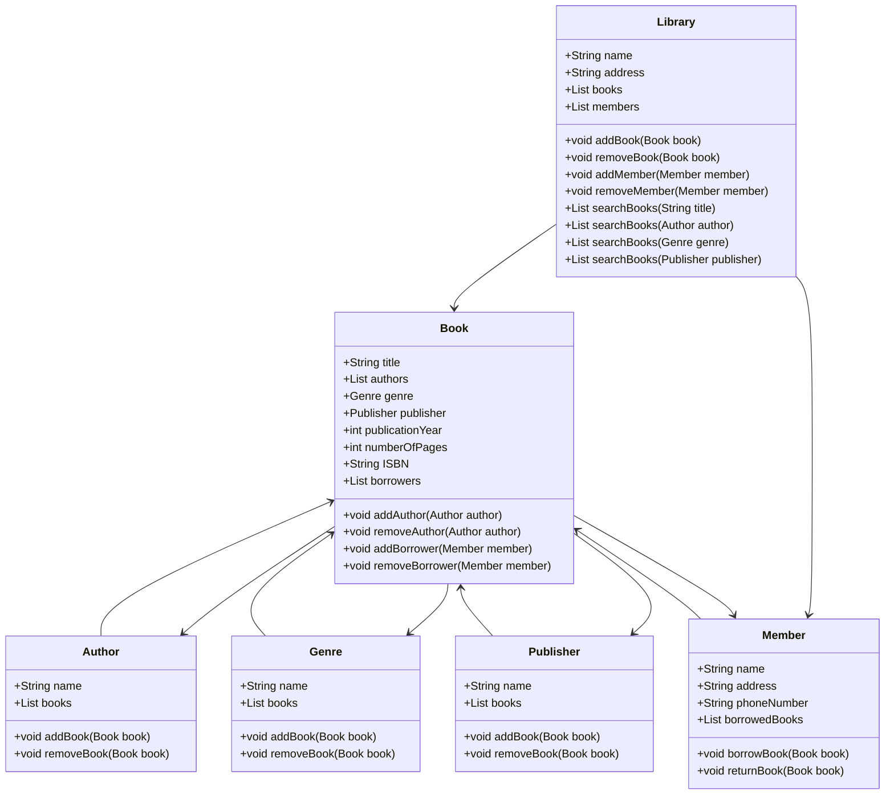
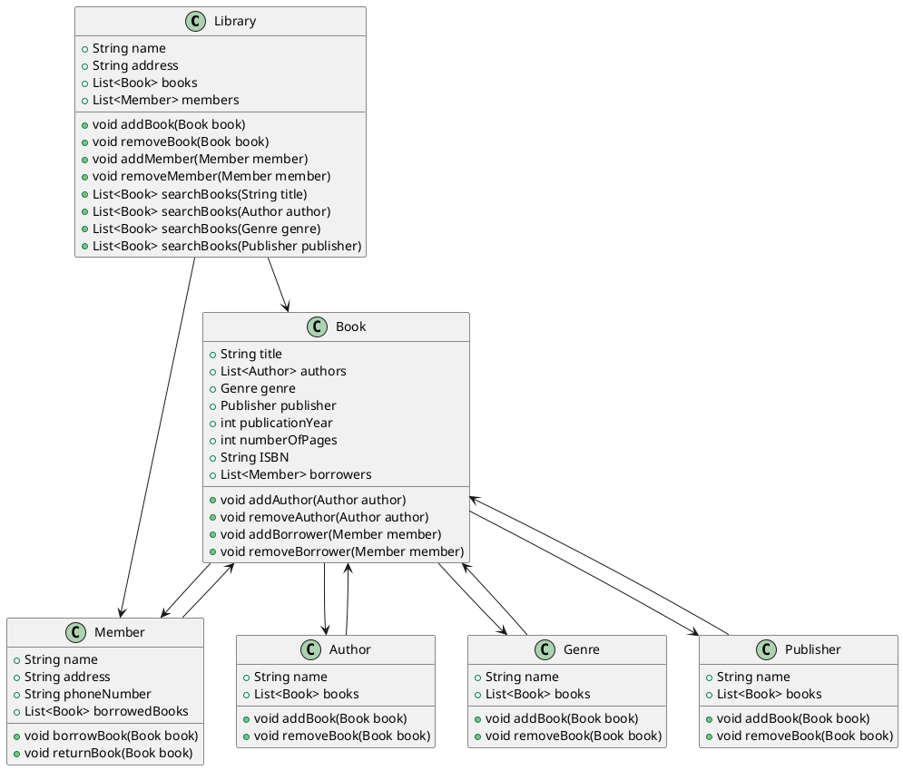

# testing mermaid

```mermaid
classDiagram
    class Library {
        +String name
        +String address
        +List<Book> books
        +List<Member> members
        +void addBook(Book book)
        +void removeBook(Book book)
        +void addMember(Member member)
        +void removeMember(Member member)
        +List<Book> searchBooks(String title)
        +List<Book> searchBooks(Author author)
        +List<Book> searchBooks(Genre genre)
        +List<Book> searchBooks(Publisher publisher)
    }
    class Book {
        +String title
        +List<Author> authors
        +Genre genre
        +Publisher publisher
        +int publicationYear
        +int numberOfPages
        +String ISBN
        +List<Member> borrowers
        +void addAuthor(Author author)
        +void removeAuthor(Author author)
        +void addBorrower(Member member)
        +void removeBorrower(Member member)
    }
    class Author {
        +String name
        +List<Book> books
        +void addBook(Book book)
        +void removeBook(Book book)
    }
    class Member {
        +String name
        +String address
        +String phoneNumber
        +List<Book> borrowedBooks
        +void borrowBook(Book book)
        +void returnBook(Book book)
    }
    class Genre {
        +String name
        +List<Book> books
        +void addBook(Book book)
        +void removeBook(Book book)
    }
    class Publisher {
        +String name
        +List<Book> books
        +void addBook(Book book)
        +void removeBook(Book book)
    }
    Library --> Book
    Library --> Member
    Book --> Author
    Book --> Genre
    Book --> Publisher
    Book --> Member
    Author --> Book
    Member --> Book
    Genre --> Book
    Publisher --> Book
```

# test PlantUML

```plantuml
@startuml
class Library {
    +String name
    +String address
    +List<Book> books
    +List<Member> members
    +void addBook(Book book)
    +void removeBook(Book book)
    +void addMember(Member member)
    +void removeMember(Member member)
    +List<Book> searchBooks(String title)
    +List<Book> searchBooks(Author author)
    +List<Book> searchBooks(Genre genre)
    +List<Book> searchBooks(Publisher publisher)
}
class Book {
    +String title
    +List<Author> authors
    +Genre genre
    +Publisher publisher
    +int publicationYear
    +int numberOfPages
    +String ISBN
    +List<Member> borrowers
    +void addAuthor(Author author)
    +void removeAuthor(Author author)
    +void addBorrower(Member member)
    +void removeBorrower(Member member)
}
class Author {
    +String name
    +List<Book> books
    +void addBook(Book book)
    +void removeBook(Book book)
}
class Member {
    +String name
    +String address
    +String phoneNumber
    +List<Book> borrowedBooks
    +void borrowBook(Book book)
    +void returnBook(Book book)
}
class Genre {
    +String name
    +List<Book> books
    +void addBook(Book book)
    +void removeBook(Book book)
}
class Publisher {
    +String name
    +List<Book> books
    +void addBook(Book book)
    +void removeBook(Book book)
}
Library --> Book
Library --> Member
Book --> Author
Book --> Genre
Book --> Publisher
Book --> Member
Author --> Book
Member --> Book
Genre --> Book
Publisher --> Book
@enduml
```
